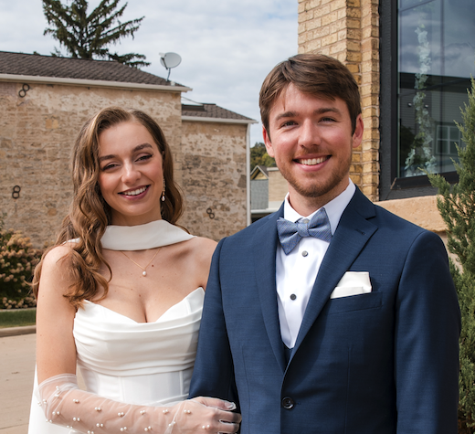

::::: hero
:::: hero-text
::: hero-name
Hi, I'm Dylan
:::

```{=html}
<div class="social-row">
  <a href="https://www.linkedin.com/in/dylanpieper" class="icon-button" aria-label="LinkedIn"><i class="fab fa-linkedin"></i></a>
  <a href="https://github.com/dylanpieper" class="icon-button" aria-label="GitHub"><i class="fab fa-github"></i></a>
  <a href="https://web-cdn.bsky.app/profile/dylanpieper.bsky.social" class="icon-button" aria-label="Bluesky"><i class="fab fa-bluesky"></i></a>
  <a href="mailto:dylanpieper@gmail.com" class="icon-button" aria-label="Email"><i class="fas fa-envelope"></i></a>
</div>
```
::::

```{=html}
<div class="photo-grid">
  <div class="photo-tile"></div>
  <div class="photo-tile"></div>
  <div class="photo-tile"></div>
  <div class="photo-tile"></div>
</div>
```
:::::

## About {#about}

::: prose
I'm a data scientist and engineer focused on building things that help people and human-centered organizations. I trained as a social psychologist, and now I engineer data tools and AI applications at RMI to support the climate and clean energy transition. I build in the open and share what I learn—[LLM-powered classification in R](https://dylanpieper.github.io/posit-25/) at posit::conf(2025), and [redquack](https://r-consortium.org/posts/redquack-an-r-package-for-memory-efficient-redcap-to-duckdb-workflows) at R/Medicine.

Some of my work is smaller and closer to home. I built [gemnotes](#software) so my wife could track her hours toward clinical licensure. As a person who enjoys life, I find balance being with my dog and in nature. I'm a paragliding pilot and practice yoga and meditation. 🐾 🧘🪂🏔️
:::

## Software {#software}

```{=html}
<div class="software-grid">
  <article class="software-card">
    
    <h3 class="software-name">redquack</h3>
    <p class="software-desc">R package that transfers a REDCap project into a database in chunks, so large projects stay queryable with dplyr instead of sitting in memory. Works with any DBI backend.</p>
    <p class="software-note">Built for for DuckDB 🦆</p>
    <div class="software-links">
      <a class="icon-button" href="https://github.com/dylanpieper/redquack" target="_blank" rel="noopener" aria-label="redquack on GitHub"><svg viewBox="0 0 16 16" width="18" height="18" fill="currentColor" aria-hidden="true"><path d="M8 0C3.58 0 0 3.58 0 8c0 3.54 2.29 6.53 5.47 7.59.4.07.55-.17.55-.38 0-.19-.01-.82-.01-1.49-2.01.37-2.53-.49-2.69-.94-.09-.23-.48-.94-.82-1.13-.28-.15-.68-.52-.01-.53.63-.01 1.08.58 1.23.82.72 1.21 1.87.87 2.33.66.07-.52.28-.87.51-1.07-1.78-.2-3.64-.89-3.64-3.95 0-.87.31-1.59.82-2.15-.08-.2-.36-1.02.08-2.12 0 0 .67-.21 2.2.82.64-.18 1.32-.27 2-.27.68 0 1.36.09 2 .27 1.53-1.04 2.2-.82 2.2-.82.44 1.1.16 1.92.08 2.12.51.56.82 1.27.82 2.15 0 3.07-1.87 3.75-3.65 3.95.29.25.54.73.54 1.48 0 1.07-.01 1.93-.01 2.2 0 .21.15.46.55.38A8.013 8.013 0 0 0 16 8c0-4.42-3.58-8-8-8z"></path></svg></a>
      <a class="icon-button" href="https://dylanpieper.github.io/redquack/" target="_blank" rel="noopener" aria-label="redquack documentation"><i class="fas fa-arrow-up-right-from-square"></i></a>
    </div>
  </article>
  <article class="software-card">
    
    <h3 class="software-name">gemnotes</h3>
    <p class="software-desc">Shiny app for therapists logging hours toward clinical licensure, giving each therapist a private dashboard behind Google sign-in.</p>
    <p class="software-note">Built for my wife, Julia ❤️</p>
    <div class="software-links">
      <a class="icon-button" href="https://github.com/dylanpieper/gemnotes" target="_blank" rel="noopener" aria-label="gemnotes on GitHub"><svg viewBox="0 0 16 16" width="18" height="18" fill="currentColor" aria-hidden="true"><path d="M8 0C3.58 0 0 3.58 0 8c0 3.54 2.29 6.53 5.47 7.59.4.07.55-.17.55-.38 0-.19-.01-.82-.01-1.49-2.01.37-2.53-.49-2.69-.94-.09-.23-.48-.94-.82-1.13-.28-.15-.68-.52-.01-.53.63-.01 1.08.58 1.23.82.72 1.21 1.87.87 2.33.66.07-.52.28-.87.51-1.07-1.78-.2-3.64-.89-3.64-3.95 0-.87.31-1.59.82-2.15-.08-.2-.36-1.02.08-2.12 0 0 .67-.21 2.2.82.64-.18 1.32-.27 2-.27.68 0 1.36.09 2 .27 1.53-1.04 2.2-.82 2.2-.82.44 1.1.16 1.92.08 2.12.51.56.82 1.27.82 2.15 0 3.07-1.87 3.75-3.65 3.95.29.25.54.73.54 1.48 0 1.07-.01 1.93-.01 2.2 0 .21.15.46.55.38A8.013 8.013 0 0 0 16 8c0-4.42-3.58-8-8-8z"></path></svg></a>
      <a class="icon-button" href="https://dylanpieper-gemnotes.share.connect.posit.cloud/" target="_blank" rel="noopener" aria-label="gemnotes live app"><i class="fas fa-arrow-up-right-from-square"></i></a>
    </div>
  </article>
</div>
```

## Experience {#experience}

:::: entry-card
[2026–Present]{.entry-year}

::: entry-body
[Data Engineer]{.entry-title} [RMI (Rocky Mountain Institute)]{.entry-org}
:::
::::

:::: entry-card
[2025–2026]{.entry-year}

::: entry-body
[Interim Evaluator, Research Analyst]{.entry-title} [University of Wisconsin-Madison School of Medicine and Public Health]{.entry-org}
:::
::::

:::: entry-card
[2021–2025]{.entry-year}

::: entry-body
[Data Scientist]{.entry-title} [University of Pittsburgh School of Pharmacy]{.entry-org}
:::
::::

:::: entry-card
[2020–2021]{.entry-year}

::: entry-body
[Research Specialist]{.entry-title} [University of Maryland, Michele Gelfand's Culture Lab]{.entry-org}
:::
::::

## Education {#education}

:::: entry-card
[2018–2020]{.entry-year}

::: entry-body
[Social Psychology]{.entry-title} [MA]{.entry-degree} [University of Northern Iowa]{.entry-org}

[GPA 3.91]{.gpa-badge}
:::
::::

:::: entry-card
[2014–2018]{.entry-year}

::: entry-body
[Psychology]{.entry-title} [BA]{.entry-degree} [University of Northern Iowa]{.entry-org}

[GPA 3.54]{.gpa-badge}
:::
::::

## Talks {#talks}

```{=html}
<div class="index-list">

<div class="index-row" data-type="talk">
  <span class="index-year">2025</span>
  <span class="index-main">
    <span class="index-title">From messy to meaningful data: LLM-powered classification in R</span>
    <span class="index-meta">posit::conf</span>
  </span>
  <a class="index-link" href="https://dylanpieper.github.io/posit-25/" target="_blank" rel="noopener noreferrer"
     aria-label="Open &quot;From messy to meaningful data: LLM-powered classification in R&quot; in a new tab">
    <i class="fas fa-arrow-up-right-from-square" aria-hidden="true"></i>
  </a>
</div>

<div class="index-row" data-type="talk">
  <span class="index-year">2025</span>
  <span class="index-main">
    <span class="index-title">redquack: Memory-efficient REDCap-to-DuckDB workflows</span>
    <span class="index-meta">R/Medicine</span>
  </span>
  <a class="index-link" href="https://r-consortium.org/posts/redquack-an-r-package-for-memory-efficient-redcap-to-duckdb-workflows" target="_blank" rel="noopener noreferrer"
     aria-label="Open &quot;redquack: Memory-efficient REDCap-to-DuckDB workflows&quot; in a new tab">
    <i class="fas fa-arrow-up-right-from-square" aria-hidden="true"></i>
  </a>
</div>

</div>
```

## Research {#research}

```{=html}
<div class="index-list">

<div class="index-row" data-type="paper">
  <span class="index-year">2022</span>
  <span class="index-main">
    <span class="index-title">Politicizing mask-wearing: Predicting the success of behavioral interventions among Republicans and Democrats in the U.S.</span>
    <span class="index-meta">Scientific Reports <span class="index-sep">·</span> with Dimant, Clemente &amp; Azevedo</span>
  </span>
  <span class="index-type">Paper</span>
  <a class="index-link" href="https://doi.org/10.1038/s41598-022-10524-1" target="_blank" rel="noopener noreferrer"
     aria-label="Open &quot;Politicizing mask-wearing: Predicting the success of behavioral interventions among Republicans and Democrats in the U.S.&quot; in a new tab">
    <i class="fas fa-arrow-up-right-from-square" aria-hidden="true"></i>
  </a>
</div>

<div class="index-row" data-type="paper">
  <span class="index-year">2021</span>
  <span class="index-main">
    <span class="index-title">Persuading conservatives and liberals to comply with mask-wearing: An intervention tournament</span>
    <span class="index-meta">Journal of Experimental Social Psychology <span class="index-sep">·</span> with Gelfand, Li, Stamkou &amp; 6 others</span>
  </span>
  <span class="index-type">Paper</span>
  <a class="index-link" href="https://doi.org/10.1016/j.jesp.2022.104299" target="_blank" rel="noopener noreferrer"
     aria-label="Open &quot;Persuading conservatives and liberals to comply with mask-wearing: An intervention tournament&quot; in a new tab">
    <i class="fas fa-arrow-up-right-from-square" aria-hidden="true"></i>
  </a>
</div>

<div class="index-row" data-type="paper">
  <span class="index-year">2021</span>
  <span class="index-main">
    <span class="index-title">Cultural tightness–looseness and COVID-19 cases and deaths: A global analysis</span>
    <span class="index-meta">The Lancet: Planetary Health <span class="index-sep">·</span> with Gelfand, Jackson, Pan &amp; 6 others</span>
  </span>
  <span class="index-type">Paper</span>
  <a class="index-link" href="https://doi.org/10.1016/S2542-5196(20)30301-6" target="_blank" rel="noopener noreferrer"
     aria-label="Open &quot;Cultural tightness–looseness and COVID-19 cases and deaths: A global analysis&quot; in a new tab">
    <i class="fas fa-arrow-up-right-from-square" aria-hidden="true"></i>
  </a>
</div>

<div class="index-row" data-type="poster">
  <span class="index-year">2021</span>
  <span class="index-main">
    <span class="index-title">COVID-19: Meta-norms to wear masks and social distance in the U.S.</span>
    <span class="index-meta">Society for Personality and Social Psychology <span class="index-sep">·</span> with Gelfand &amp; Denison</span>
  </span>
  <span class="index-type">Poster</span>
  <a class="index-link" href="https://osf.io/y8cug" target="_blank" rel="noopener noreferrer"
     aria-label="Open &quot;COVID-19: Meta-norms to wear masks and social distance in the U.S.&quot; in a new tab">
    <i class="fas fa-arrow-up-right-from-square" aria-hidden="true"></i>
  </a>
</div>

<div class="index-row" data-type="thesis">
  <span class="index-year">2020</span>
  <span class="index-main">
    <span class="index-title">Challenging social systems under the threat of pollution: Replication and extension of Eadeh and Chang (2019)</span>
    <span class="index-meta">Master's thesis, University of Northern Iowa</span>
  </span>
  <span class="index-type">Thesis</span>
  <a class="index-link" href="https://scholarworks.uni.edu/etd/1028" target="_blank" rel="noopener noreferrer"
     aria-label="Open &quot;Challenging social systems under the threat of pollution: Replication and extension of Eadeh and Chang (2019)&quot; in a new tab">
    <i class="fas fa-arrow-up-right-from-square" aria-hidden="true"></i>
  </a>
</div>

<div class="index-row" data-type="poster">
  <span class="index-year">2020</span>
  <span class="index-main">
    <span class="index-title">The effect of environmental and violent-crime threats on political orientation and attitudes</span>
    <span class="index-meta">Midwestern Psychological Association <span class="index-sep">·</span> with Hirano &amp; Harton</span>
  </span>
  <span class="index-type">Poster</span>
  <a class="index-link" href="https://osf.io/3n7r8" target="_blank" rel="noopener noreferrer"
     aria-label="Open &quot;The effect of environmental and violent-crime threats on political orientation and attitudes&quot; in a new tab">
    <i class="fas fa-arrow-up-right-from-square" aria-hidden="true"></i>
  </a>
</div>

<div class="index-row" data-type="poster">
  <span class="index-year">2020</span>
  <span class="index-main">
    <span class="index-title">Challenging the system under the threat of pollution: Low system justification mediates a liberal political shift</span>
    <span class="index-meta">Society for Personality and Social Psychology</span>
  </span>
  <span class="index-type">Poster</span>
  <a class="index-link" href="https://osf.io/v7nez" target="_blank" rel="noopener noreferrer"
     aria-label="Open &quot;Challenging the system under the threat of pollution: Low system justification mediates a liberal political shift&quot; in a new tab">
    <i class="fas fa-arrow-up-right-from-square" aria-hidden="true"></i>
  </a>
</div>

</div>
```

```{=html}
<footer class="site-footer">
  <div class="social-row">
    <a href="https://www.linkedin.com/in/dylanpieper" class="icon-button" aria-label="LinkedIn"><i class="fab fa-linkedin"></i></a>
    <a href="https://github.com/dylanpieper" class="icon-button" aria-label="GitHub"><i class="fab fa-github"></i></a>
    <a href="https://web-cdn.bsky.app/profile/dylanpieper.bsky.social" class="icon-button" aria-label="Bluesky"><i class="fab fa-bluesky"></i></a>
    <a href="mailto:dylanpieper@gmail.com" class="icon-button" aria-label="Email"><i class="fas fa-envelope"></i></a>
  </div>
  <p>Built with Quarto. Set in Althera.</p>
</footer>
```