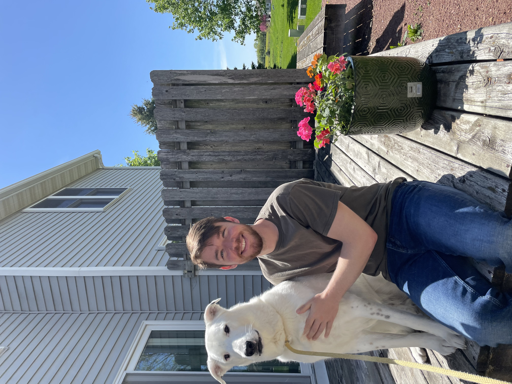

```{=html}
<style>
.resume-linkedin {
  display: inline-flex;
  align-items: center;
  gap: 0.6rem;
  margin-top: 1.25rem;
  padding: 0.65rem 1.1rem;
  border-radius: 6px;
  background-color: #ffffff;
  border-left: 4px solid #4c5f75;
  box-shadow: 0 2px 5px rgba(0,0,0,0.05);
  color: #4c5f75;
  font-weight: bold;
  text-decoration: none;
  transition: all 0.2s ease;
}
.resume-linkedin:hover {
  box-shadow: 0 5px 15px rgba(0,0,0,0.1);
  color: #212529;
  text-decoration: none;
}
.resume-linkedin svg {
  flex-shrink: 0;
}
.gpa-badge {
  display: inline-block;
  background-color: #f8f9fa;
  color: #333;
  font-weight: bold;
  font-size: 0.85em;
  padding: 2px 8px;
  border-radius: 4px;
  border: 1px solid #ddd;
  margin-right: 6px;
}
</style>
```

```{=html}
<div style="display: flex; gap: 2rem; align-items: flex-start; flex-wrap: wrap; margin-bottom: 1.5rem;">
  
  <div style="flex: 1; min-width: 260px;">
    <p style="margin: 0;"><b>Data scientist</b> with 5+ years of experience across research and program evaluation. Builds the full analytic stack from databases and pipelines to statistical models, reports, dashboards, and AI applications. Translates big and messy datasets into tools that guide stakeholders and non-technical audiences. Advocates for open-source software and open science.</p>
    <a class="resume-linkedin" href="https://www.linkedin.com/in/dylanpieper" target="_blank" rel="noopener">
      <svg width="20" height="20" viewBox="0 0 24 24" fill="currentColor"><path d="M20.447 20.452h-3.554v-5.569c0-1.328-.027-3.037-1.852-3.037-1.853 0-2.136 1.445-2.136 2.939v5.667H9.351V9h3.414v1.561h.046c.477-.9 1.637-1.85 3.37-1.85 3.601 0 4.267 2.37 4.267 5.455v6.286zM5.337 7.433c-1.144 0-2.063-.926-2.063-2.065 0-1.138.92-2.063 2.063-2.063 1.14 0 2.064.925 2.064 2.063 0 1.139-.925 2.065-2.064 2.065zm1.782 13.019H3.555V9h3.564v11.452zM22.225 0H1.771C.792 0 0 .774 0 1.729v20.542C0 23.227.792 24 1.771 24h20.451C23.2 24 24 23.227 24 22.271V1.729C24 .774 23.2 0 22.222 0h.003z"></path></svg>
      Full Profile on LinkedIn
    </a>
  </div>
</div>
```

## Experience

**Research Analyst** — University of Wisconsin-Madison School of Medicine and Public Health (2025–Present)

Lead data analytics and infrastructure development for medical education research and program evaluation, supporting faculty and staff projects and strategic planning for the Collective for Innovation, Scholarship, and Research in Undergraduate Medical Education (CISR-UME).

**Data Scientist** — University of Pittsburgh School of Pharmacy (2021–2025)

Led data strategy for grants in the health sciences, including topics of substance use and criminal justice. I conducted research and program evaluation, communicated with stakeholders, and developed data collection methods, databases, pipelines, reports, and dashboards. I also contributed to business management and staff training.

## Education

**Master of Arts, Social Psychology** — University of Northern Iowa (2018–2020) [GPA 3.91]{.gpa-badge}

Statistical computing (R), quantitative thesis, research assistant in psychoneuroendocrinology lab

**Bachelor of Arts, Psychology** — University of Northern Iowa (2014–2018) [GPA 3.54]{.gpa-badge}

## Skills

**Research methods:** Statistics, multilevel modeling, psychometrics, mixed methods research, machine learning (ML), natural language processing (NLP), large language models (LLM), web scraping, reproducible report design, interactive visualization, dashboard development, geospatial mapping or GIS, web application development, package development

**Data collection and reporting:** Quarto, Shiny, Plotly, D3, Tableau, MS Power, REDCap, Qualtrics, API endpoints

**Languages and infrastructure:** R, Python, SQL (MySQL, PostgreSQL, DuckDB), Git, Docker, Podman, Azure, MS Foundry, Posit Connect, Linux, Sentry, WordPress, HTML/CSS/JS, web asset design