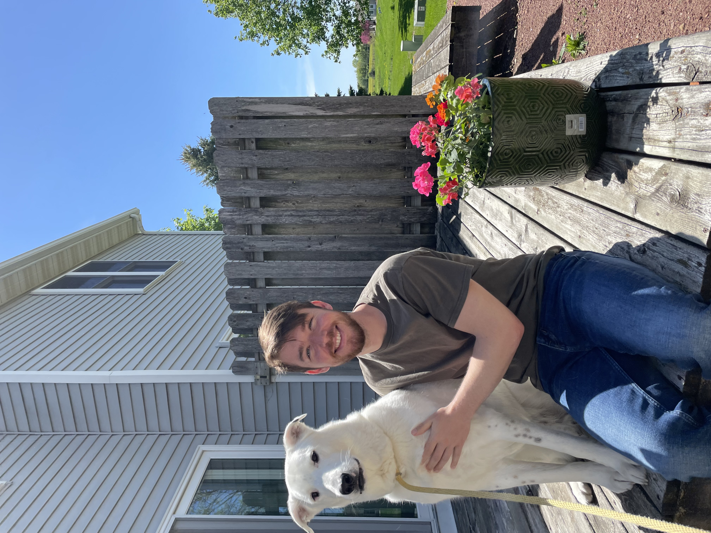

::::::::::::: resume-layout
:::::: resume-sidebar
{.resume-photo fig-alt="Dylan Pieper with Archie"}

```{=html}
<a class="resume-linkedin" href="https://www.linkedin.com/in/dylanpieper" target="_blank" rel="noopener">
  <svg width="20" height="20" viewBox="0 0 24 24" fill="currentColor"><path d="M20.447 20.452h-3.554v-5.569c0-1.328-.027-3.037-1.852-3.037-1.853 0-2.136 1.445-2.136 2.939v5.667H9.351V9h3.414v1.561h.046c.477-.9 1.637-1.85 3.37-1.85 3.601 0 4.267 2.37 4.267 5.455v6.286zM5.337 7.433c-1.144 0-2.063-.926-2.063-2.065 0-1.138.92-2.063 2.063-2.063 1.14 0 2.064.925 2.064 2.063 0 1.139-.925 2.065-2.064 2.065zm1.782 13.019H3.555V9h3.564v11.452zM22.225 0H1.771C.792 0 0 .774 0 1.729v20.542C0 23.227.792 24 1.771 24h20.451C23.2 24 24 23.227 24 22.271V1.729C24 .774 23.2 0 22.222 0h.003z"></path></svg>
  Full Profile on LinkedIn
</a>
```

### Research methods

::: chips
- Statistics
- Multilevel modeling
- Psychometrics
- Mixed methods research
- Machine learning (ML)
- Natural language processing (NLP)
- Large language models (LLM)
- Web scraping
- Reproducible report design
- Interactive visualization
- Dashboard development
- Geospatial mapping (GIS)
- Web application development
- Package development
:::

### Data collection and reporting

::: chips
- Quarto
- Shiny
- Plotly
- D3
- Tableau
- MS Power
- REDCap
- Qualtrics
- API endpoints
:::

### Languages and infrastructure

::: chips
- R
- Python
- SQL
- MySQL
- PostgreSQL
- DuckDB
- Git
- Docker
- Podman
- Azure
- MS Foundry
- Posit Connect
- Linux
- Sentry
- WordPress
- HTML/CSS/JS
- Web asset design
:::
::::::

:::::::: resume-main
## Experience

::: entry-card
[2025–Present]{.entry-year}

[Interim Evaluator, Research Analyst]{.entry-title} [University of Wisconsin-Madison School of Medicine and Public Health]{.entry-org}

Lead program evaluation and data analytics for the Medical Education Office, translating faculty research questions and the school's reporting needs into analytic workflows across the curriculum. Build reports, dashboards, and AI applications. Support strategic planning for the Collective for Innovation, Scholarship, and Research in Undergraduate Medical Education.
:::

::: entry-card
[2021–2025]{.entry-year}

[Data Scientist]{.entry-title} [University of Pittsburgh School of Pharmacy]{.entry-org}

Led data and analytics engineering across substance use treatment and criminal justice projects, translating funder and community-partner needs into workflows spanning clinical, operational, and government data systems. Developed data collection methods, databases, pipelines, reports, and dashboards. Supported funding and effort tracking, resource allocation, and staff training.
:::

::: entry-card
[2020–2021]{.entry-year}

[Research Specialist]{.entry-title} [University of Maryland, Michele Gelfand's Culture Lab]{.entry-org}

Published cultural predictors of COVID-19 cases and deaths across 57 countries using multilevel statistical models, conducted randomized experiments testing message framing for wearing masks, and developed a natural language processing Shiny app to compare threatening language across texts.
:::

## Education

::: entry-card
[2018–2020]{.entry-year}

[Master of Arts, Social Psychology]{.entry-title} [University of Northern Iowa]{.entry-org}

[GPA 3.91]{.gpa-badge}
:::

::: entry-card
[2014–2018]{.entry-year}

[Bachelor of Arts, Psychology]{.entry-title} [University of Northern Iowa]{.entry-org}

[GPA 3.54]{.gpa-badge}
:::
::::::::
:::::::::::::